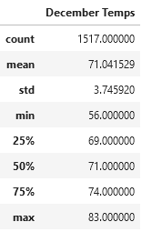
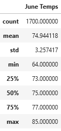

# Surf's Up

## Overview

For this project we used SQLALchemy and Pandas to get information from a SQLite database and put it into a DataFrame. Then we did a quick summary Analysis.

### Purpose

In order to find out the viability of opening a surf shop in Hawaii, we need some information about the weather. We already have a database with the information we need, so we just need to pull the information out with Python to more easily analyze it. 

## Results

This will be a short section since we only performed a basic analysis.

### Overall

> 

>Summary statistics for the months of December and June.

The temperatures are mild in the months of December and June, without much variation.

### Main Points
<!-- Provide a bulleted list with three major points from the two analysis deliverables. Use images as support where needed. (media/dec_summary.png) and media/june_summary.png) -->

* If we compare the mean and 50th percentile for both months, we can see that they are almost the same. The temperatures are evenly distributed around the center.
* The standard deviation is around 3.5 for both months, so on most days the temperatures will be close to the average for the month. 
* There is only a small difference between the temperatures in June and December. The June temperatures are a few degrees warmer, but the majority of temperatures in both months are in a very comfortable range. 


## Summary
<!-- Provide a high-level summary of the results -->
From the simple analysis we perfeormed the temperatures don't appear to be an obstacle to opening a surf and ice cream shop in Hawaii. The temperatures are consistent and comfortable. They could be a little on the cool side for ice cream, but when you're used to Texas temperatures anything below 80 degrees is a cool day. 

## Additional Queries
<!-- Provide two additional queries that you would perform to gather more weather data for June and December -->

Now that we know the temperatures overall are great for our little venture, we need to look at the precipitation. To get that data we will use a query similar to the one we used for temperatures.
```
session.query(Measurement.prcp).filter(func.extract('month', Measurement.date) == 12).all()
```

Additionally, we will probably want to look into the weather at each individual station to get a more detailed idea of where we want to place our surf and ice cream shop.
```
session.query(Measurement.station, func.avg(Measurement.tobs), func.avg(Measurement.prcp)).\
        filter(func.extract('month', Measurement.date) == 6).\
        group_by(Measurement.station).all()
```
While Pandas is better suited to performin our analysis than SQLAlchemy, this query will give us a quick look at the average weather at each station in the month of June. Changing the filter to month 12 will give us the weather for December.
